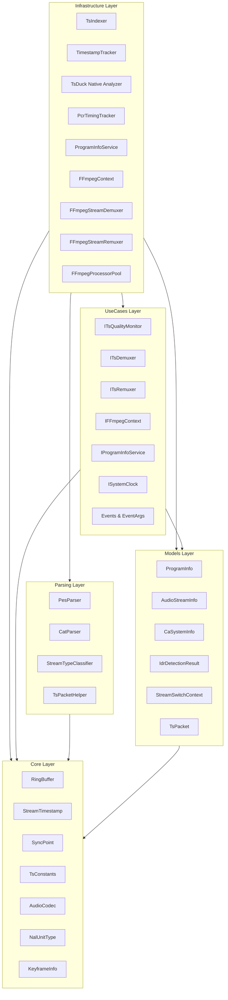
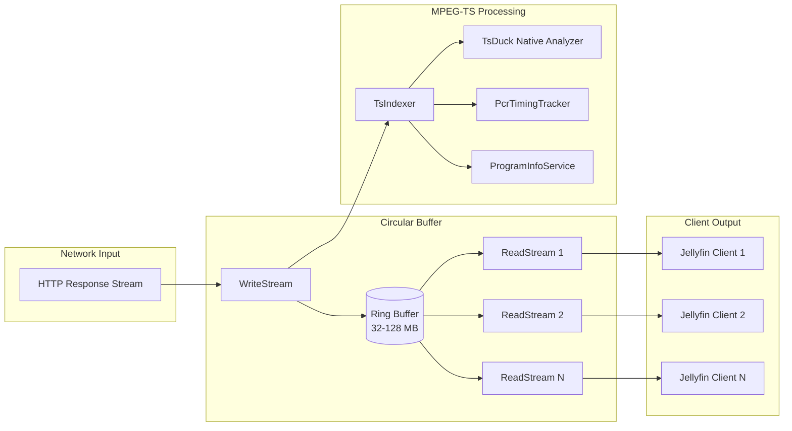
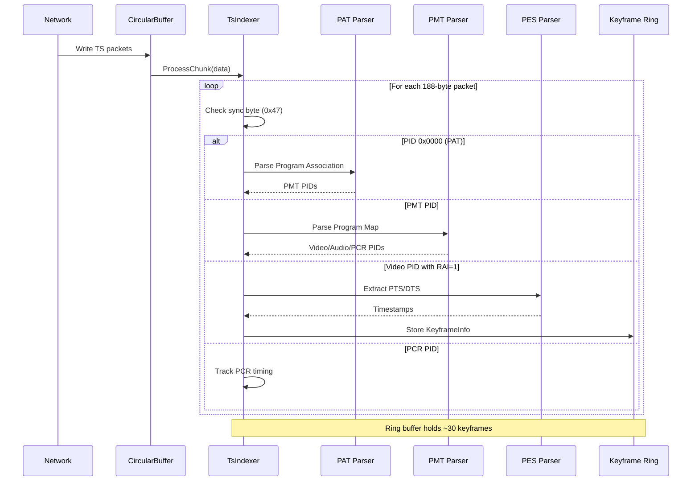
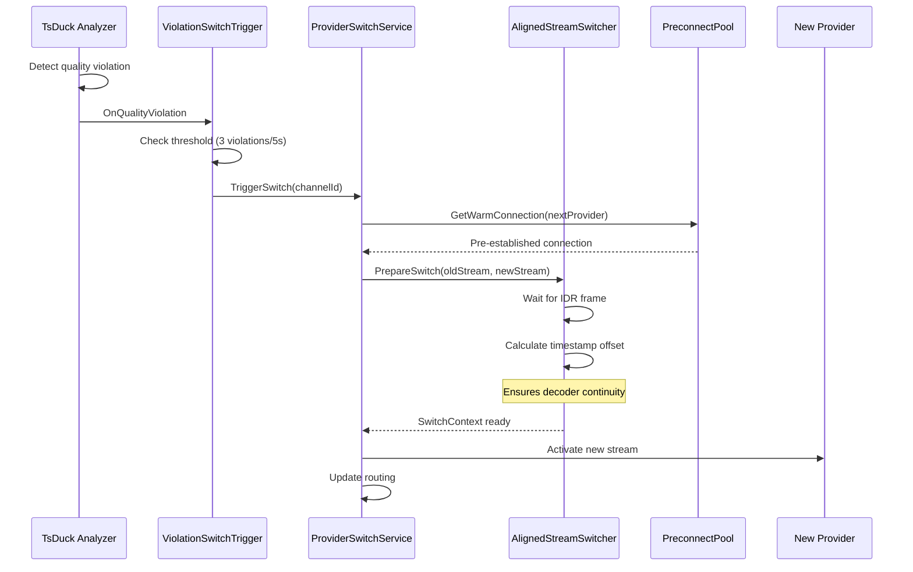
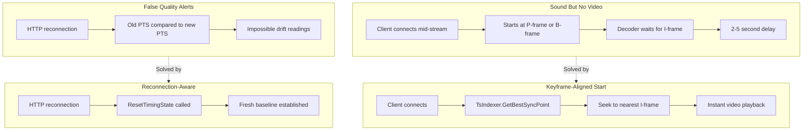
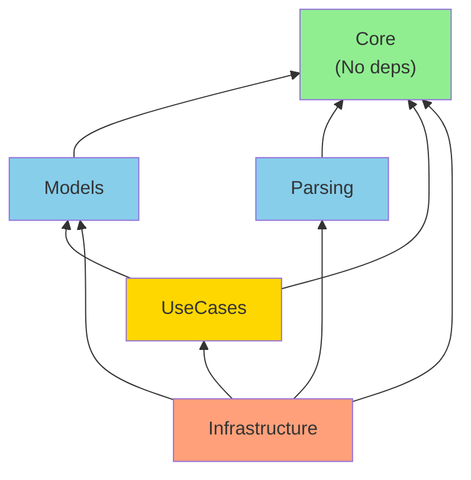
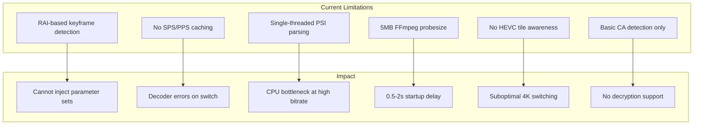
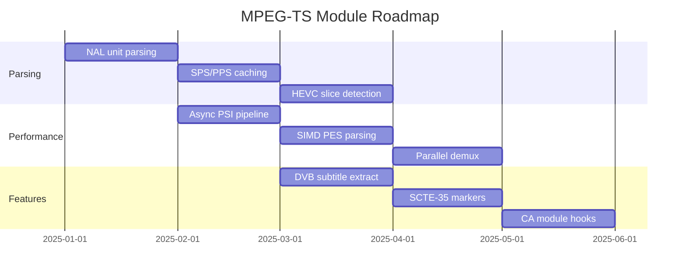
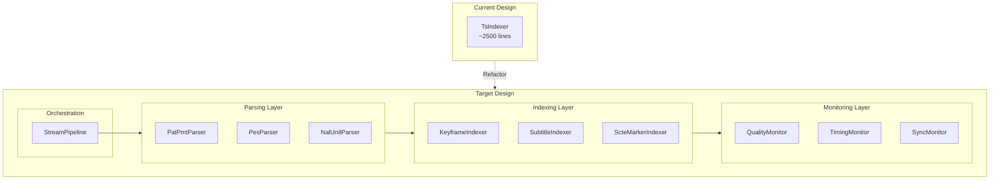

# MPEG-TS Module

## Overview

Production-grade MPEG-TS processing module for live streaming applications. Provides real-time transport stream analysis, keyframe indexing, quality monitoring per TR 101 290, and seamless provider switching with IDR frame alignment.

## Architecture

The module follows Clean Architecture principles with strict dependency rules:



## Data Flow

### Stream Processing Pipeline



### Keyframe Detection Flow



### Provider Switch Flow



## Module Structure

```
MpegTs/
├── Core/                    # Domain primitives (no dependencies)
│   ├── AudioCodec.cs        # Audio codec enumeration
│   ├── ClockStatus.cs       # PCR clock state
│   ├── KeyframeInfo.cs      # Keyframe metadata
│   ├── NalUnitType.cs       # H.264/HEVC NAL types
│   ├── PictureCodingType.cs # MPEG-2 picture types
│   ├── RingBuffer.cs        # Lock-free circular buffer
│   ├── StreamCategory.cs    # Stream classification
│   ├── StreamTimestamp.cs   # PTS/DTS wrapper
│   ├── SyncPoint.cs         # Buffer sync position
│   ├── SyncStatus.cs        # A/V sync state
│   └── TsConstants.cs       # MPEG-TS magic numbers
│
├── Models/                  # Data transfer objects
│   ├── AudioFrameInfo.cs    # Audio frame metadata
│   ├── AudioStreamInfo.cs   # Audio stream details
│   ├── CaSystemInfo.cs      # Conditional access info
│   ├── CachedParameterSets.cs # SPS/PPS cache
│   ├── IdrDetectionResult.cs  # IDR frame detection
│   ├── ProgramInfo.cs       # Program/stream mapping
│   ├── RemappingResult.cs   # Timestamp remapping
│   ├── StreamSwitchContext.cs # Provider switch state
│   ├── StreamSyncPoint.cs   # Aligned sync position
│   ├── TimestampOffset.cs   # PTS/DTS offset
│   ├── TsIndexerMetrics.cs  # Performance counters
│   └── TsPacket.cs          # Parsed packet structure
│
├── Parsing/                 # Pure parsing utilities
│   ├── CatParser.cs         # Conditional Access Table
│   ├── PesParser.cs         # PES header extraction
│   ├── StreamTypeClassifier.cs # Stream type detection
│   └── TsPacketHelper.cs    # Low-level packet ops
│
├── UseCases/                # Interface contracts
│   ├── IContinuityMonitor.cs
│   ├── ICrcMonitor.cs
│   ├── IEncryptionDetector.cs
│   ├── IFFmpegContext.cs
│   ├── IInProcessRemuxer.cs
│   ├── IProgramInfoService.cs
│   ├── IQualityEventSource.cs
│   ├── IStreamRemuxer.cs
│   ├── IStreamStatistics.cs
│   ├── ISyncMonitor.cs
│   ├── ISystemClock.cs
│   ├── ITsDemuxer.cs
│   ├── ITsQualityMonitor.cs
│   ├── ITsRemuxer.cs
│   ├── ITsTimestampPatcher.cs
│   ├── DemuxedPacketEventArgs.cs
│   ├── DemuxerProgramEventArgs.cs
│   ├── PtsDiscontinuityEventArgs.cs
│   ├── StreamQualityViolationEventArgs.cs
│   └── SyncDriftEventArgs.cs
│
└── Infrastructure/          # Service implementations
    ├── DiscontinuityInjector.cs
    ├── FFmpegContext.cs
    ├── FFmpegContextAdapter.cs
    ├── FFmpegFrameDetector.cs
    ├── FFmpegInitializationService.cs
    ├── FFmpegParameterSetExtractor.cs
    ├── FFmpegProcessorBase.cs
    ├── FFmpegStreamDemuxer.cs
    ├── FFmpegStreamRemuxer.cs
    ├── PacketStatistics.cs
    ├── PcrTimingTracker.cs
    ├── ProgramInfoService.cs
    ├── StopwatchClock.cs
    ├── TimestampTracker.cs
    ├── TsIndexer.cs
    ├── TsTimestampPatcher.cs
    └── Pooling/
        ├── FFmpegProcessorKind.cs
        ├── FFmpegProcessorPool.cs
        ├── IPoolable.cs
        ├── IPooledFFmpegProcessor.cs
        ├── ObjectPool.cs
        ├── PoolLease.cs
        ├── PoolOptions.cs
        ├── PoolStatistics.cs
        └── PooledFFmpegProcessor.cs
```

## Features

### Industry-Grade Capabilities

| Feature | Description |
|---------|-------------|
| **Multi-Program (MPTS)** | Independent tracking per program in multi-program streams |
| **Packet Reassembly** | Handles TCP fragmentation across 188-byte boundaries |
| **Lock-Free Design** | Zero contention using atomic operations and ring buffers |
| **SIMD Optimization** | AVX-512/AVX2/SSE2 accelerated sync byte search |
| **Zero-Allocation** | Hot paths avoid GC through fixed buffers and unsafe code |
| **TR 101 290** | Broadcast quality monitoring per ETSI standard |
| **A/V Sync** | Real-time audio/video drift detection (EBU R37) |
| **FFmpeg Integration** | Native demuxing via FFmpeg.AutoGen bindings |

### Solves Common Problems



## Usage

### Initialization

```csharp
// TsIndexer is automatically created by CircularBufferWriteStream
var writeStream = new CircularBufferWriteStream(
    bufferSize: 64 * 1024 * 1024,  // 64MB for HD
    loggerFactory: loggerFactory
);

// Access the indexer for monitoring
var indexer = writeStream.TsIndexer;
```

### Writing Data

```csharp
// Indexing happens automatically during writes
await writeStream.WriteAsync(networkData, cancellationToken);
```

### Reading from Optimal Position

```csharp
// ReadStream auto-seeks to nearest keyframe
var readStream = new CircularBufferReadStream(
    writeStream,
    logger,
    streamId,
    channelName,
    discordService,
    programNumber: -1  // -1 = first program
);
```

### Multi-Program Streams

```csharp
// Get all detected programs
int[] programs = indexer.GetProgramNumbers();

// Get info for specific program
int videoPid = indexer.GetVideoPid(programNumber: 2);
int keyframes = indexer.GetKeyframeCount(programNumber: 2);
SyncStatus status = indexer.GetSyncStatus(programNumber: 2);
double driftMs = indexer.GetCurrentDriftMs(programNumber: 2);
```

### Quality Monitoring

```csharp
// Subscribe to quality events
indexer.StreamQualityViolation += (sender, e) => {
    logger.LogWarning("Quality issue: {Type} - {Details}",
        e.ViolationType, e.Details);
};

indexer.SyncDriftDetected += (sender, e) => {
    logger.LogWarning("A/V drift: {DriftMs}ms, Status: {Status}",
        e.DriftMs, e.Status);
};

// Get diagnostics
string diagnostics = indexer.GetDiagnostics();
```

### Handling Reconnections

```csharp
// Prevent false drift readings after reconnection
if (isReconnection)
{
    writeStream.TsIndexer.ResetTimingState();
}
```

## Performance

### Optimizations

| Technique | Impact |
|-----------|--------|
| SIMD sync search | 10-40x faster than scalar |
| Unsafe pointer arithmetic | Bounds-check elimination |
| 32-bit start code detection | Single comparison vs 3 bytes |
| Fixed-size ring buffers | Zero allocations in hot path |
| Lookup table classification | O(1) stream type detection |
| Cache-line padding | No false sharing |
| Power-of-2 buffers | Bitwise AND vs modulo |

### Metrics

| Metric | Value |
|--------|-------|
| CPU Overhead | ~0.03-0.05% @ 20 Mbps |
| Memory per Program | ~2-4 KB |
| Keyframe Lookup | < 1 us |
| Sync Byte Search | ~10-40 GB/s (SIMD) |
| Packet Parsing | ~5-10 GB/s |
| Hot Path Allocations | 0 bytes |

## TR 101 290 Compliance

### Priority 1 Checks

| Check | Description | Threshold |
|-------|-------------|-----------|
| Transport Error (TEI) | Uncorrectable packet errors | Any occurrence |
| Continuity Counter | Packet sequence gaps | Any discontinuity |
| PCR Jitter | Clock stability | +/- 500ns |
| PCR PID | Declared PID carries PCR | Missing PCR |

### Priority 2 Checks

| Check | Description | Threshold |
|-------|-------------|-----------|
| PAT Version | Program table changes | Version increment |
| PMT Version | Stream map changes | Version increment |
| PCR Interval | Clock update frequency | > 100ms |

### A/V Synchronization States

| Status | Description | Threshold |
|--------|-------------|-----------|
| Synchronized | Within spec | +/- 20ms (EBU R37) |
| AudioAhead | Audio leads video | > 20ms |
| AudioBehind | Video leads audio | > 20ms |
| Drifting | Accumulating offset | > 40ms/minute |

## Supported Codecs

### Video (stream_type)

| Codec | Type | Notes |
|-------|------|-------|
| H.264/AVC | 0x1B | Most common |
| HEVC/H.265 | 0x24 | 4K/HDR |
| VVC/H.266 | 0x33 | Next-gen |
| MPEG-2 | 0x02 | Legacy broadcast |
| MPEG-4 Visual | 0x10 | Rare |

### Audio (stream_type)

| Codec | Type | Notes |
|-------|------|-------|
| AAC ADTS | 0x0F | Common |
| AAC LATM | 0x11 | DVB standard |
| AC-3 | 0x81 | Dolby Digital |
| E-AC-3 | 0x84/0x87 | Dolby Digital+ |
| DTS | 0x82 | Lossless option |
| MP2 | 0x04 | Legacy |

## Dependency Rules



**Rules:**
- Core has no dependencies (only BCL)
- Inner layers cannot reference outer layers
- External libraries (FFmpeg) isolated in Infrastructure
- Interfaces defined in UseCases, implemented in Infrastructure

## Areas of Improvement

### Current Limitations



| Limitation | Current State | Desired State |
|------------|---------------|---------------|
| Keyframe Detection | RAI flag only | NAL unit parsing for IDR/CRA |
| Parameter Sets | Not cached | Cache SPS/PPS/VPS per stream |
| PSI Parsing | Synchronous | Async with pipeline |
| FFmpeg Init | Blocking 5MB | Streaming probe with timeout |
| HEVC Support | Basic | Tile-aware slice detection |
| Encryption | Detect only | DVB-CI decryption hooks |
| Subtitles | Passthrough | DVB-SUB/teletext extraction |

### Technical Debt

1. **TsIndexer Size** - Single file with multiple responsibilities, should be split into:
   - `PatPmtParser` - PSI table handling
   - `KeyframeIndexer` - RAI/IDR detection
   - `QualityMonitor` - TR 101 290 checks
   - `TimingTracker` - PCR/PTS/DTS management

2. **FFmpeg Coupling** - Infrastructure layer tightly coupled to FFmpeg.AutoGen:
   - Should abstract behind `IFrameDetector` interface
   - Allow pure managed fallback for simple cases

3. **Ring Buffer Generics** - `RingBuffer<T>` is specialized for `KeyframeInfo`:
   - Could be generic for reuse in other contexts
   - Memory layout optimization opportunities

## Future Plans

### Short-Term Improvements



### Planned Enhancements

| Feature | Description | Priority |
|---------|-------------|----------|
| NAL Unit Parser | Parse H.264/HEVC NAL units for precise IDR detection | High |
| Parameter Set Cache | Cache SPS/PPS/VPS per PID for injection on switch | High |
| Async PSI Pipeline | Non-blocking PAT/PMT parsing with events | Medium |
| SIMD PES Parsing | AVX2-accelerated PES header extraction | Medium |
| DVB-SUB Extraction | Parse DVB subtitles for Jellyfin display | Medium |
| SCTE-35 Detection | Ad marker detection for future ad replacement | Low |
| CA Module Hooks | Interface for external decryption modules | Low |

### Architecture Goals



## References

- ISO/IEC 13818-1: MPEG-2 Systems
- ITU-T H.222.0: Generic coding of moving pictures
- DVB BlueBook A038: Random Access Indicator
- ETSI TR 101 290: DVB measurement guidelines
- EBU R37: Audio/video sync tolerance
- ITU-T H.264: AVC NAL unit specification
- ITU-T H.265: HEVC NAL unit specification
- SCTE-35: Digital Program Insertion Cueing
