# Jellyfin.Xtream

The Jellyfin.Xtream plugin integrates content from [Xtream-compatible APIs](https://xtream-ui.org/api-xtreamui-xtreamcode/) into your [Jellyfin](https://jellyfin.org/) instance.

## Acknowledgments

This plugin was originally created by [Kevinjil](https://github.com/Kevinjil). Thank you for the excellent foundation and continued work on this project!

## Features

- **Multi-Provider Support**: Configure multiple Xtream providers with automatic failover and quality-based channel deduplication
- **Live TV, VOD, Series & Catch-up**: Full support for all Xtream content types
- **Smart Restreaming**: Single connection to provider with multi-client broadcasting (solves HTTP 406 errors)
- **EPG Support**: Multiple EPG providers with fallback chain and external XMLTV support
- **Stream Quality Monitoring**: Real-time MPEG-TS quality analysis with TR 101 290 compliance
- **SCTE-35 Ad Marker Detection**: Real-time splice point detection for ad break notifications
- **NAL Unit Parsing**: H.264/H.265 parameter set extraction for faster decoder initialization
- **Automatic Provider Switching**: Quality-driven failover with IDR frame alignment
- **Fast Channel Change**: Connection pre-warming for sub-100ms provider switches
- **Discord Notifications**: Stream health alerts, EPG refresh status, and periodic health reports
- **Proxy Support**: Route traffic through HTTP proxy with authentication
- **User-Agent Rotation**: Rotate through realistic browser User-Agents to avoid WAF blocking
- **Rate Limiting**: Token bucket rate limiting to prevent provider bans
- **Connection Management**: State tracking, connection limits, and auto-kill of oldest streams

## System Architecture

### High-Level Overview

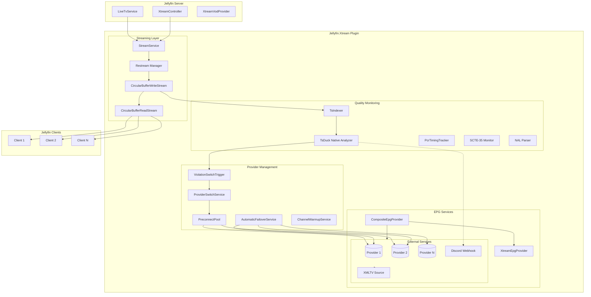

### Restreaming Architecture

The plugin uses a native C++ streaming layer that handles HTTP connections, failover, and quality monitoring. Data flows from the native layer to C# via direct callbacks (188-byte aligned TS packets), then broadcasts to multiple Jellyfin clients using an optimized circular buffer.

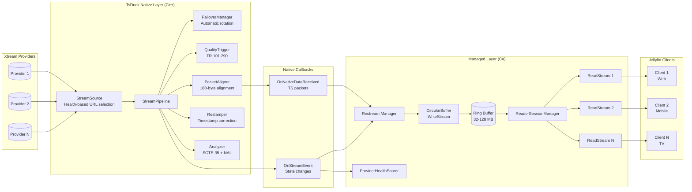

**Buffer sizes by quality:**
- SD streams: 32 MB (~45 seconds at 6 Mbps)
- HD streams: 64 MB (~25 seconds at 20 Mbps)
- 4K/UHD streams: 128 MB (~20 seconds at 50 Mbps)

### Provider Failover System

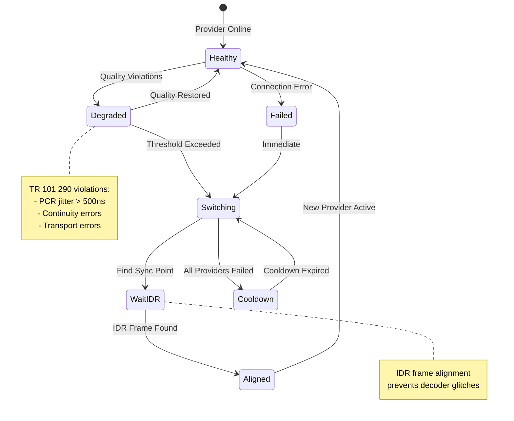

### Provider Switch Sequence

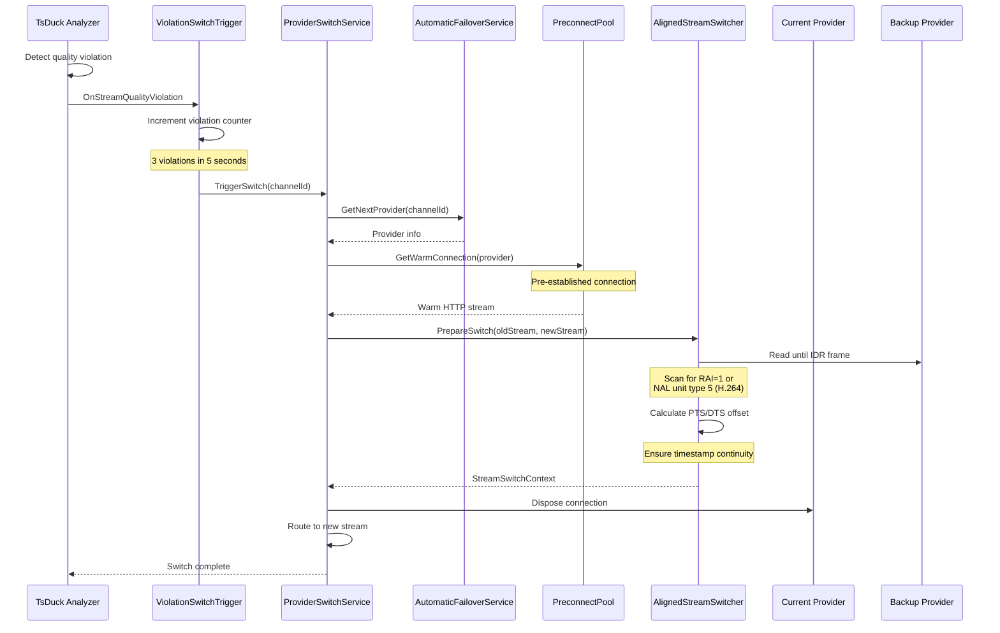

### EPG Provider Chain

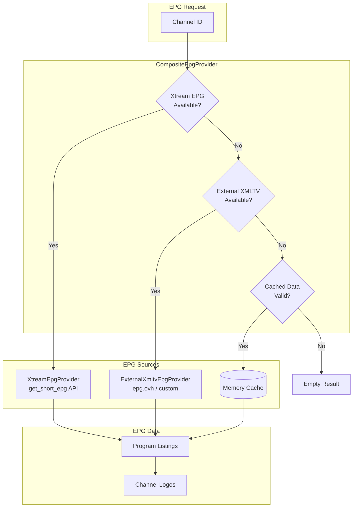

## Installation

The plugin can be installed using a custom plugin repository.

### Add Repository

1. Open your admin dashboard and navigate to `Plugins`.
2. Select the `Repositories` tab on the top of the page.
3. Click the `+` symbol to add a repository.
4. Enter `Jellyfin.Xtream` as the repository name.
5. Enter [`https://kevinjil.github.io/Jellyfin.Xtream/repository.json`](https://kevinjil.github.io/Jellyfin.Xtream/repository.json) as the repository URL.
6. Click save.

### Install Plugin

1. Open your admin dashboard and navigate to `Plugins`.
2. Select the `Catalog` tab on the top of the page.
3. Under `Live TV`, select `Jellyfin Xtream`.
4. (Optional) Select the desired plugin version.
5. Click `Install`.
6. Restart your Jellyfin server to complete the installation.

## Configuration

### Provider Setup

Configure one or more Xtream-compatible providers in the plugin settings.

| Property | Description |
|----------|-------------|
| Base URL | The API endpoint URL (excluding trailing slash), including protocol (http/https) |
| Username | The username for API authentication |
| Password | The password for API authentication |

### Content Selection

#### Live TV

1. Open the `Live TV` configuration tab.
2. Select the categories or individual channels you want available.
3. Click `Save`.
4. (Optional) Open `TV Overrides` to customize channel numbers, names, and icons.

#### Video On-Demand

1. Open the `Video On-Demand` configuration tab.
2. Enable `Show this channel to users`.
3. Select the categories or individual videos.
4. Click `Save`.

#### Series

1. Open the `Series` configuration tab.
2. Enable `Show this channel to users`.
3. Select the categories or individual series.
4. Click `Save`.

#### TV Catch-up

1. Open the `Live TV` configuration tab.
2. Enable `Show the catch-up channel to users`.
3. Click `Save`.

### Advanced Configuration

#### Multi-Provider Settings

| Setting | Description | Default |
|---------|-------------|---------|
| Merge Duplicate Channels | Combine same-name channels from different providers | Off |
| Enable Provider Failover | Automatically switch to backup provider on failure | Off |
| Max Failover Attempts | Maximum retry attempts before giving up | 3 |
| Quality-Driven Switching | Switch providers based on TR 101 290 violations | Off |
| Violation Threshold | Number of violations before triggering switch | 3 |
| Violation Window | Time window for counting violations (seconds) | 5 |

#### Fast Channel Change

| Setting | Description | Default |
|---------|-------------|---------|
| Enable Preconnection | Warm backup provider connections | Off |
| Preconnect Channels | Number of channels to pre-warm | 5 |
| Connection TTL | How long to keep warm connections (seconds) | 30 |

#### Proxy Settings

| Setting | Description | Default |
|---------|-------------|---------|
| Enable Proxy | Route traffic through HTTP proxy | Off |
| Proxy Address | Proxy server hostname or IP | - |
| Proxy Port | Proxy server port | 8080 |
| Proxy Username | Optional proxy authentication | - |
| Proxy Password | Optional proxy authentication | - |
| Bypass Local | Skip proxy for local addresses | On |

#### User-Agent Settings

| Setting | Description | Default |
|---------|-------------|---------|
| Custom User-Agent | Override with specific User-Agent string | - |
| Enable Rotation | Rotate through browser User-Agents | Off |
| Random Selection | Use random (weighted by market share) vs sequential | On |

#### Rate Limiting

| Setting | Description | Default |
|---------|-------------|---------|
| Enable Rate Limiting | Limit API requests to prevent bans | Off |
| Requests Per Second | Maximum requests per second | 5 |
| Burst Size | Initial burst allowance | 20 |

#### Connection Limits

| Setting | Description | Default |
|---------|-------------|---------|
| Enforce Connection Limit | Limit concurrent streams | Off |
| Max Concurrent Streams | Maximum active streams (0 = use provider limit) | 0 |
| Auto-Kill Oldest | Terminate oldest stream when limit reached | On |

#### EPG Settings

| Setting | Description | Default |
|---------|-------------|---------|
| Enable External EPG | Use external XMLTV source as fallback | Off |
| External EPG URL | XMLTV source URL | - |
| Logo Base URL | Base URL for logo fallback | - |
| Use Logo Fallback | Fall back to external logos when missing | On |

#### Discord Notifications

| Setting | Description | Default |
|---------|-------------|---------|
| Enable Notifications | Send Discord webhook notifications | Off |
| Webhook URL | Discord webhook endpoint | - |
| Notify on Buffer Overflow | Alert on restream buffer issues | On |
| Notify on Stream Error | Alert on stream failures | On |
| Notify on Stream Killed | Alert when streams are terminated | On |
| Notify on Quality Violation | Alert on TR 101 290 violations | On |
| Notify on A/V Drift | Alert on audio/video sync issues | On |
| Notify on EPG Refresh | Alert on EPG refresh completion | On |
| Notify on SCTE-35 Event | Alert on ad break start/end | Off |
| Periodic Health Reports | Send regular health summaries | Off |
| Health Report Interval | Minutes between health reports | 60 |

## Stream Quality Monitoring

Real-time MPEG-TS analysis following TR 101 290 standards:

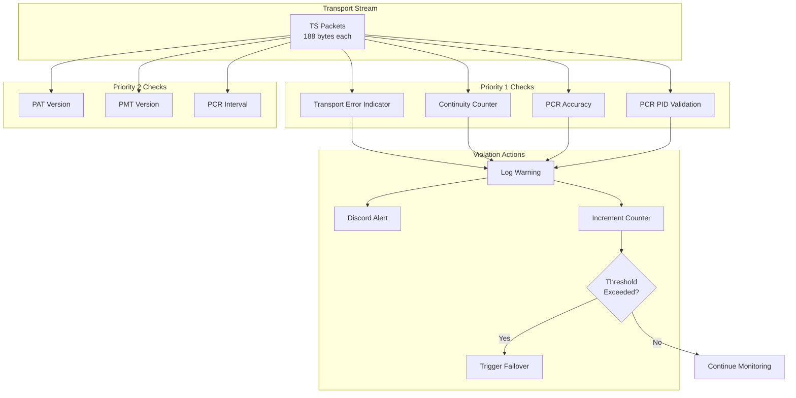

### SCTE-35 Ad Marker Detection

Real-time detection of SCTE-35 splice points for ad break management:

| Event Type | Command | Description |
|------------|---------|-------------|
| Splice Insert | 0x05 | Primary ad insertion/return command |
| Time Signal | 0x06 | Time-based splice point |
| Splice Schedule | 0x04 | Scheduled future splice events |

Features:
- Automatic SCTE-35 PID detection from PMT (stream type 0x86 or CUEI descriptor)
- Splice state tracking (In Content, In Ad Break, Transitioning)
- Event ring buffer with thread-safe access
- Callback support for real-time notifications

### NAL Unit Parsing & Codec Detection

Automatic extraction of video codec parameters for optimized playback:

| Codec | Parameter Sets | Detection |
|-------|---------------|-----------|
| H.264/AVC | SPS, PPS | NAL types 7, 8 |
| H.265/HEVC | VPS, SPS, PPS | NAL types 32, 33, 34 |
| H.266/VVC | (Future) | - |

Extracted Information:
- Profile and level
- Resolution (with cropping/conformance window)
- Frame rate (from VUI timing info)
- Interlaced flag
- IDR frame detection (more accurate than RAI flag)

Benefits:
- Faster decoder initialization with cached parameter sets
- Accurate keyframe detection for seamless provider switching
- Codec information for quality reporting

### Monitored Metrics

| Check | Priority | Description | Threshold |
|-------|----------|-------------|-----------|
| Transport Error (TEI) | 1 | Uncorrectable packet errors | Any occurrence |
| Continuity Counter | 1 | Packet sequence discontinuities | Any gap |
| PCR Jitter | 1 | Clock reference stability | +/- 500ns |
| PCR PID | 1 | Declared PID carries PCR | Missing PCR |
| PAT Version | 2 | Program table changes | Version change |
| PMT Version | 2 | Stream map changes | Version change |
| PCR Interval | 2 | Clock update frequency | > 100ms |
| A/V Drift | - | Audio/video sync | > 20ms (EBU R37) |
| SCTE-35 Events | - | Ad break splice points | Event-based |
| IDR Frames | - | Keyframe detection | Per-PID tracking |
| Codec Info | - | Video parameters | SPS/VPS parsing |

## Project Structure

```mermaid
graph TD
    subgraph Plugin["Jellyfin.Xtream"]
        Root[Plugin Entry]

        subgraph API["API Layer"]
            Controller[XtreamController]
            Models[Request/Response Models]
        end

        subgraph Services["Service Layer"]
            Stream[StreamService]
            Channel[ChannelProviderMap]
            EPG[EPG Services]
        end

        subgraph Provider["Provider Management"]
            Failover[AutomaticFailoverService]
            Switch[ProviderSwitchService]
            Health[ProviderAvailabilityService]
            Metrics[ProviderMetricsTracker]
        end

        subgraph MpegTs["MPEG-TS Module"]
            Core[Core Types]
            Parsing[Parsers]
            Infra[Infrastructure]
            UseCases[Interfaces]
        end

        subgraph Buffer["Buffer System"]
            Write[WriteStream]
            Read[ReadStream]
            Session[SessionManager]
        end
    end

    subgraph Tests["Jellyfin.Xtream.Tests"]
        Unit[Unit Tests]
        Integration[Integration Tests]
    end

    subgraph Benchmarks["Jellyfin.Xtream.Benchmarks"]
        Perf[Performance Benchmarks]
    end

    Root --> API
    Root --> Services
    Services --> Provider
    Services --> MpegTs
    Services --> Buffer
    MpegTs --> Buffer
    Provider --> MpegTs
```

## Development Status

### Recent Changes (January 2025)

#### Native Streaming Architecture Refactor

The streaming architecture has been significantly refactored. C++ is now the main orchestrator for streaming, failover, and URL selection, while C# serves as a thin setup and consumption layer.

| Component | Status | Description |
|-----------|--------|-------------|
| **Callback-Based Data Transfer** | ✅ Complete | Direct callbacks from C++ worker thread replace shared memory |
| **P/Invoke Callback Methods** | ✅ Complete | `StreamerSetOutputCallback()`, `StreamerSetEventCallback()` |
| **GCHandle Management** | ✅ Complete | Prevents GC of callback delegates during native execution |
| **StreamPipeline (C++)** | ✅ Complete | Orchestrates URL selection, failover, quality monitoring |
| **StreamSource (C++)** | ✅ Complete | Health-based URL selection with quarantine logic |
| **Quarantine Logic** | ✅ Complete | Exponential backoff (30s initial, 5min max) for failed URLs |
| **V2 API Removal** | ✅ Complete | Removed SQLite metrics database and shared memory buffer |
| **E2E Test Coverage** | ✅ Complete | 107 tests passing with native interop validation |

#### Health-Based Provider Selection

Bidirectional health management: C# manages long-term patterns, C++ handles instant decisions.

| Component | Status | Description |
|-----------|--------|-------------|
| **ProviderHealthScorer** | ✅ Complete | Weighted health scoring for provider selection |
| **StreamingOutcomeRecorder** | ✅ Complete | Tracks streaming success/failure outcomes |
| **Health Score Algorithm** | ✅ Complete | 50.0 initial, +0.5 success, -5.0 failure, range 0-100 |
| **Quality-Based Switching** | ✅ Complete | Configurable thresholds trigger provider switches |

#### SCTE-35 and NAL Parser Integration

Integrated into the native analyzer API for real-time stream analysis.

| Component | Status | Description |
|-----------|--------|-------------|
| **SCTE-35 Event Retrieval** | ✅ Complete | `tsduck_analyzer_get_scte35_events()` for pending splice events |
| **SCTE-35 State Tracking** | ✅ Complete | `tsduck_analyzer_get_scte35_state()` for ad break state |
| **SCTE-35 Callbacks** | ✅ Complete | `tsduck_analyzer_set_scte35_callback()` for event notifications |
| **Video Codec Info** | ✅ Complete | `tsduck_analyzer_get_video_codec_info()` for H.264/H.265/H.266 |
| **Parameter Set Caching** | ✅ Complete | `tsduck_analyzer_get_parameter_sets()` for SPS/PPS/VPS |
| **NAL-Based IDR Detection** | ✅ Complete | `tsduck_analyzer_has_idr_frame()` more accurate than RAI flag |
| **Automatic PID Detection** | ✅ Complete | SCTE-35 and video PIDs detected from PMT |

#### TsDuck Native TR 101 290 Integration

| Component | Status | Description |
|-----------|--------|-------------|
| **TsDuck Native Library** | ✅ Complete | C++ interop library for broadcast-grade TR 101 290 monitoring |
| **Native Build System** | ✅ Complete | Docker-based build for Linux, MSBuild integration |
| **ITsDuckAnalyzer Interface** | ✅ Complete | Abstraction with NativeTsDuckAnalyzer and NullTsDuckAnalyzer |
| **TsDuckMetrics** | ✅ Complete | Priority 1/2 error tracking, PCR jitter analysis, quality scoring |
| **Streaming Integration** | ✅ Complete | Wired into Restream via native callbacks |
| **Discord Integration** | ✅ Complete | TsDuck metrics in stream health notifications |

#### Provider Management Enhancements

| Component | Status | Description |
|-----------|--------|-------------|
| **Auto-Priority Scoring** | ✅ Complete | Automatic priority calculation from streaming performance |
| **Priority Property** | ✅ Complete | XtreamProvider.Priority (0-100, lower = better) |
| **Predictive Failover** | ✅ Complete | Trend analysis in AutomaticFailoverService |
| **TsDuck Metrics Forwarding** | ✅ Complete | ProviderSwitchService records TsDuck quality data |
| **UI Priority Display** | ✅ Complete | Web UI shows priority badges, sorted by performance |

#### Channel Matching Improvements

| Component | Status | Description |
|-----------|--------|-------------|
| **Unicode Separators** | ✅ Complete | Support for various Unicode characters in channel name prefixes |
| **Country Fallback** | ✅ Complete | Country-prefixed source can match country-less target |

#### Code Quality & Infrastructure

| Component | Status | Description |
|-----------|--------|-------------|
| **TsIndexer Simplification** | ✅ Complete | Removed built-in TR 101 290, delegated to TsDuck |
| **Buffer Diagnostics** | ✅ Complete | Rate-limited progress logging (10MB intervals) |
| **LiveTV Timeout Fix** | ✅ Complete | 2s timeout for optional channel name lookup |
| **Logging Refactor** | ✅ Complete | IsDebugEnabled as extension method |

### Work In Progress

| Component | Status | Description |
|-----------|--------|-------------|
| **Real-time Metrics Dashboard** | 📋 Planned | Web UI for live stream quality visualization |
| **Historical Metrics Storage** | 📋 Planned | Persist quality metrics for trend analysis |

### Known Issues Being Addressed

| Issue | Priority | Status |
|-------|----------|--------|
| Channel name lookup can timeout on slow providers | Fixed | 2s timeout added in LiveTvService |

## Areas of Improvement

Current limitations and areas where the implementation could be enhanced:

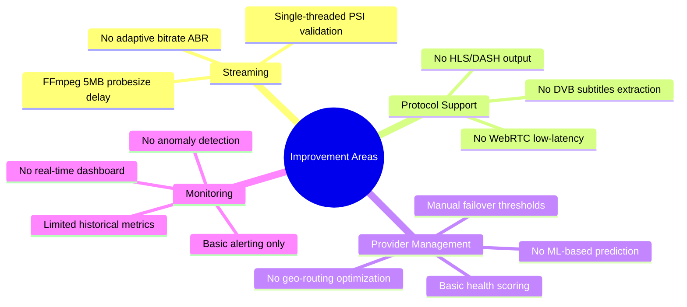

### Current Limitations

| Area | Limitation | Impact |
|------|------------|--------|
| **FFmpeg Init** | 5MB probesize blocking | Initial 0.5-2s delay on stream start |
| **Bitrate** | Single bitrate per channel | No quality adaptation for slow clients |
| **Output Format** | MPEG-TS only | No HLS/DASH for web clients |
| **Subtitles** | Not extracted | DVB subtitles passed through raw |
| **Encryption** | Detection only | Cannot decrypt CA-protected streams |
| **Geographic** | No provider geo-awareness | Suboptimal routing for global users |

## Future Plans

### Roadmap

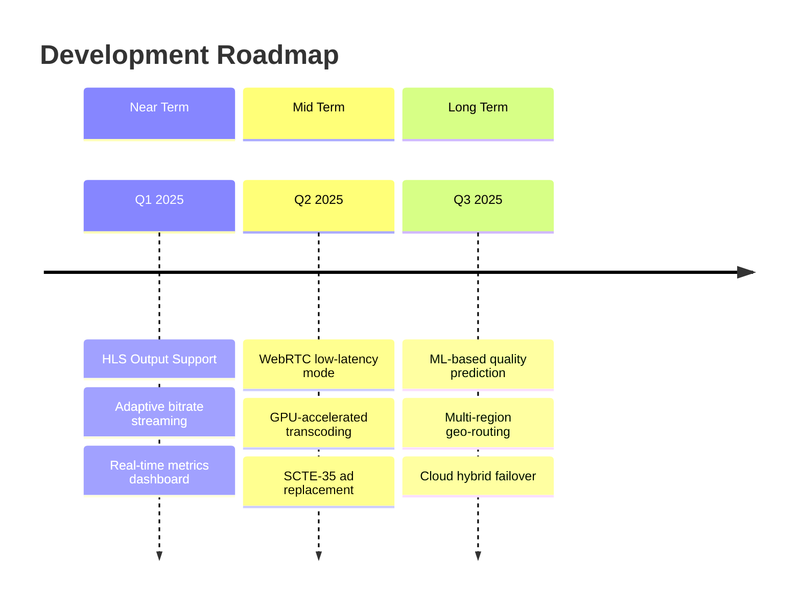

### Recently Completed Features

These features were previously planned and are now complete:

| Feature | Status | Description |
|---------|--------|-------------|
| **SCTE-35 Detection** | ✅ Complete | Real-time ad marker detection with state tracking and callbacks |
| **Parameter Set Caching** | ✅ Complete | NAL unit parsing for SPS/PPS/VPS, faster decoder initialization |
| **Health-Based Failover** | ✅ Complete | Bidirectional health scoring with C++/C# coordination |
| **Native Streaming Pipeline** | ✅ Complete | C++ orchestration with callback-based data transfer |

### Planned Features

#### Near-Term (Q1 2025)

| Feature | Description | Benefit |
|---------|-------------|---------|
| **HLS/DASH Output** | Segment MPEG-TS into HLS/DASH | Browser playback without plugins |
| **Adaptive Bitrate** | Multi-quality transcoding | Smooth playback on variable networks |
| **Metrics Dashboard** | Real-time web UI | Visual monitoring without Discord |
| **DVB Subtitle Extraction** | Parse DVB-SUB/teletext | Subtitle support in Jellyfin UI |

#### Mid-Term (Q2 2025)

| Feature | Description | Benefit |
|---------|-------------|---------|
| **WebRTC Mode** | Sub-second latency streaming | Live sports/events viewing |
| **GPU Transcoding** | NVENC/QSV/VAAPI acceleration | Lower CPU, higher quality |
| **SCTE-35 Ad Replacement** | Replace detected ad breaks with custom content | Custom ad insertion |

#### Long-Term (Q3+ 2025)

| Feature | Description | Benefit |
|---------|-------------|---------|
| **ML Quality Prediction** | Predict degradation before it happens | Proactive switching |
| **Geo-Aware Routing** | Route to nearest provider PoP | Lower latency globally |
| **Cloud Hybrid** | Failover to cloud transcoders | 100% uptime guarantee |
| **Multi-Audio** | Multiple audio track selection | Language selection per client |

### Architecture Evolution

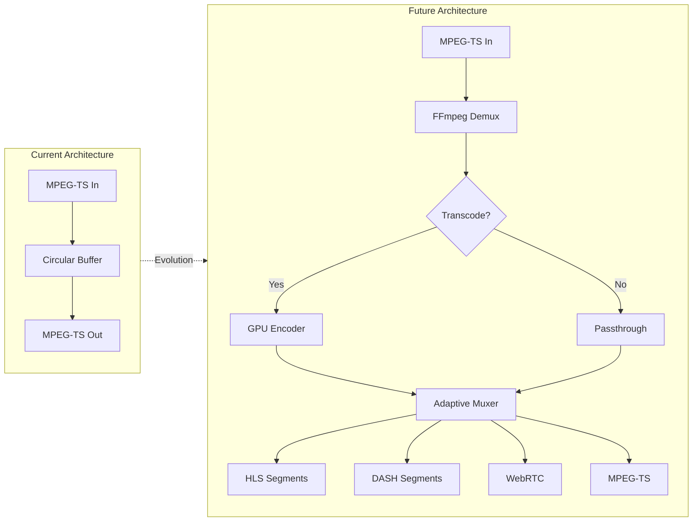

## Known Issues

### Loss of Confidentiality

Jellyfin publishes remote paths in the API and default user interface. As Xtream format paths include credentials, anyone with library access can see your provider credentials. Use this plugin with caution on shared servers.

## Troubleshooting

### Network Configuration

Ensure your [Jellyfin networking](https://jellyfin.org/docs/general/networking/) is correctly configured:

1. Open your admin dashboard and navigate to `Networking`.
2. Configure your `Published server URIs` correctly.
   Example: `all=https://jellyfin.example.com`

### Debug Logging

Enable `Debug Logging` in the plugin settings for verbose diagnostics when troubleshooting issues.

### Common Issues

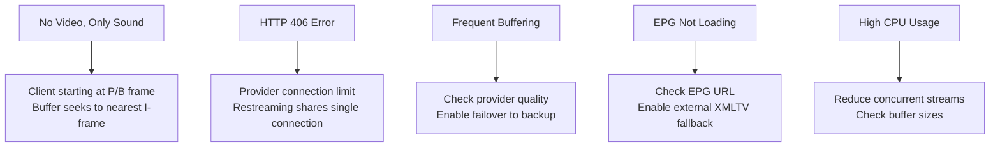

## License

This project is licensed under the GNU General Public License v3.0 - see the [LICENSE](LICENSE) file for details.
